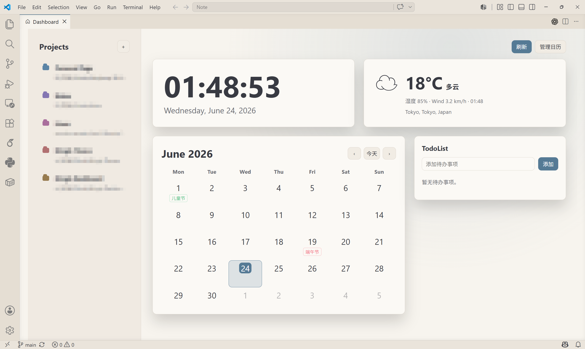

# Ningk Dashboard

[中文文档](README.zh-CN.md)

Ningk Dashboard is a personal startup dashboard for Visual Studio Code. It provides a project launcher, clock, weather, calendar subscriptions, built-in holiday support, and a simple TodoList in one VS Code webview. (The color of background is based on the theme)



## Features

- Project launcher in the left sidebar.
- Add projects from the dashboard UI without editing JSON by hand.
- Local clock and date based on the VS Code webview environment.
- Weather card powered by Open-Meteo, with automatic IP location and manual fallback coordinates.
- Monthly calendar with clickable dates.
- China mainland holiday support and custom calendar entries.
- Network iCalendar / `.ics` subscriptions.
- Clickable calendar entries: open URLs when the event provides one, otherwise show details.
- Persistent TodoList stored in VS Code extension global state.
- Theme-aware UI using VS Code theme variables.

## What changed

- Command and setting namespace is
  ingkDashboard.\*`.
- Added `Ningk Dashboard: Add Project` and a `+` button beside Projects.
- Removed placeholder-only cards and kept usable surfaces.
- Added selectable calendar dates and conditional day details.
- Added TodoList actions: add, complete, and delete.
- Cleaned release defaults: the published version does not include private local project paths.

## Commands

- `Ningk Dashboard: Open`
- `Ningk Dashboard: Refresh`
- `Ningk Dashboard: Manage Calendars`
- `Ningk Dashboard: Add Project`

## Add projects

Use either method:

- Click the `+` button beside `Projects`.
- Run `Ningk Dashboard: Add Project` from the command palette.

The extension writes entries to
ingkDashboard.projects` in VS Code settings.

## Calendar

Use `Ningk Dashboard: Manage Calendars` to enable built-in China mainland holidays or add an iCalendar subscription.

Custom calendar item example:

```json
{
  "ningkDashboard.calendarItems": [
    { "date": "2026-06-19", "title": "Release Day", "type": "event" }
  ]
}
```

Calendar subscription example:

```json
{
  "ningkDashboard.calendarSubscriptions": [
    {
      "name": "Team Calendar",
      "url": "https://example.com/calendar.ics",
      "type": "event",
      "enabled": true
    }
  ]
}
```

## Weather

Auto weather uses approximate IP location. If VPN or proxy affects the result, disconnect it and click `Refresh`, or use manual coordinates:

```json
{
  "ningkDashboard.weatherLocation": "manual",
  "ningkDashboard.city": "Shanghai",
  "ningkDashboard.latitude": 31.2304,
  "ningkDashboard.longitude": 121.4737
}
```
